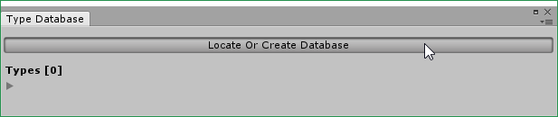
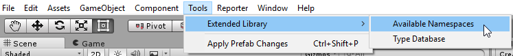

# Unity3D.ExtendedLibrary
## What are included
- `ExtendedLibrary.ExtendedEvent` (based on the foundation of [Thundernerd/Unity3D-ExtendedEvent](https://github.com/Thundernerd/Unity3D-ExtendedEvent))
- Property drawers for: `byte`, `sbyte`, `short`, `ushort`, `uint`, `long`, `ulong`, `char`, `Matrix4x4`, `Quaternion`, `Vector4`.

## Dependencies
- [Reorderable List Editor Field for Unity](https://bitbucket.org/rotorz/reorderable-list-editor-field-for-unity)
- [jacobdufault/fullserializer](https://github.com/jacobdufault/fullserializer) (Can be replaced by another JSON Serializer. In that case, `ExtendedLibrary/Extensions/JsonConverter.cs` should be modified).

## How to use
### Property drawers
No special code is needed. Just drop the folder `ExtendedLibrary` in your project and they are ready to be used.
Examples can be found in `_Scripts/Examples/NewFieldsExample.cs`.

### ExtendedEvent
1. Prebuild a reflection database for types. It contains the definition of every methods, properties and fields of each type. This prebuilt database will speed up the `ExtendedEvent` drawer in later use.

2. Create new database or locate the existing one for updating.

3. Update the `TypeDataDictionary`. By default, everything under `Unity` namespace will be included. If some custom namespaces are needed, they can be defined in the `Custom Namespaces` list.

4. Examples can be found in `_Scripts/Examples/ExtendedEventExample.cs`

