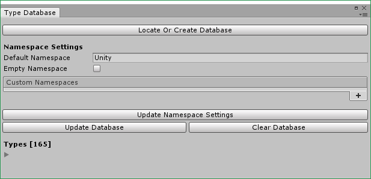

# Unity3D.ExtendedLibrary
## What are included
- Custom property drawers for: `byte`, `sbyte`, `short`, `ushort`, `uint`, `long`, `ulong`, `char`, `Matrix4x4`, `Quaternion`, `Vector4`.
- `ExtendedLibrary.ExtendedEvent` (based on the foundation of [Thundernerd/Unity3D-ExtendedEvent](https://github.com/Thundernerd/Unity3D-ExtendedEvent)).

    **Support:** primitive data types (`int`, `float`, `enum`, etc.), some Unity3D types (`Vector2`, `Vector3`, `UnityEngine.Object`, `AnimationCurve`, etc.), simple `Serializable` types, and `Array` or `List` of primitive or Unity3D types.

    **Read** `ExtendedLibrary/Events/ExtendedEvent.Value.cs` for better understanding of the supported types.

## Dependencies
- [Reorderable List Editor Field for Unity](https://bitbucket.org/rotorz/reorderable-list-editor-field-for-unity)
- [jacobdufault/fullserializer](https://github.com/jacobdufault/fullserializer) (Can be replaced by another JSON Serializer. In that case, `ExtendedLibrary/Extensions/JsonConverter.cs` should be modified).

## Limitations
### ExtendedEvent
- Since `ExtendedEvent` uses Reflection in runtime, it's not guaranteed to run on AOT platforms (IL2CPP, iOS, etc.).
- Parameter editor cannot correctly show:
    - `Array` or `List` of types that have a custom drawer (`Vector4`, `Quaternion`, `Matrix4x4`, etc.).
    - Custom drawers inside a `Serializable` type. For example, a `Matrix4x4` member of `ClassA`.

        

    **Note:** Primitive types (`byte`, `short`, `uint`, etc.) are unaffected since they have only 01 simple input field.

## How to use
### Property drawers
No special code is needed. Just drop the folder `ExtendedLibrary` in your project and they are ready to be used.
Examples can be found in `_Scripts/Examples/NewFieldsExample.cs`.

### ExtendedEvent
1. Prebuild a reflection database for types. It contains the definition of every methods, properties and fields of each type. This prebuilt database will speed up the `ExtendedEvent` drawer in later use.

    

2. Create new database or locate the existing one for updating.

    

3. Update the `TypeDataDictionary`. By default, everything under `Unity` namespace will be included. If some custom namespaces are needed, they can be defined in the `Custom Namespaces` list.

    

4. Examples can be found in `_Scripts/Examples/ExtendedEventExample.cs`

    